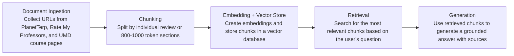

# Project 1 Planning: The Unofficial Guide

> Write this document before you write any pipeline code.
> Your spec and architecture diagram are what you'll use to direct AI tools (Claude, Copilot, etc.) to generate your implementation — the more specific they are, the more useful the generated code will be.
> Update the Retrieval Approach and Chunking Strategy sections if you change your approach during implementation.
> Update this file before starting any stretch features.

---

## Domain

<!-- What domain did you choose? Why is this knowledge valuable and hard to find through official channels? -->

I chose student reviews of CS professors at UMD because although we have a rate my professor-inspired website, it is difficult to find all possible student reviews because not everyone is inclined to post on that website regarding their personal experience. Instead you may find reviews on forums like reddit or even on various social media platforms. Furthermore, there is certain bias on more websites than one and some reviews are not as specific as others. 

---

## Documents

<!-- List your specific sources: URLs, subreddit names, forum threads, or file descriptions.
     Aim for at least 10 sources that together cover different subtopics or perspectives within your domain. -->
| #  | Source                                   | Description                                                                             | URL or location                                    |
| -- | ---------------------------------------- | --------------------------------------------------------------------------------------- | -------------------------------------------------- |
| 1  | PlanetTerp CMSC132 Reviews               | Student reviews for CMSC132 professors.                                                 | https://planetterp.com/course/CMSC132/reviews      |
| 2  | PlanetTerp CMSC216 Reviews               | Student reviews for CMSC216 professors and course workload.                             | https://planetterp.com/course/CMSC216/reviews      |
| 3  | PlanetTerp CMSC250                       | Ratings and professor history for CMSC250.                                              | https://planetterp.com/course/CMSC250              |
| 4  | PlanetTerp CMSC330 Reviews               | Student reviews for CMSC330 instructors.                                                | https://planetterp.com/course/CMSC330/reviews      |
| 5  | PlanetTerp CMSC351                       | Ratings and review counts for CMSC351 professors.                                      | https://planetterp.com/course/CMSC351              |
| 6  | PlanetTerp Justin Wyss-Gallifent         | Professor-level reviews for Justin Wyss-Gallifent across CMSC courses.                 | https://planetterp.com/professor/wyss-gallifent    |
| 7  | PlanetTerp Larry Herman                  | Professor-level reviews for Larry Herman across CMSC courses.                          | https://planetterp.com/professor/herman_larry      |
| 8  | Rate My Professors Fawzi Emad            | Student ratings and comments for Fawzi Emad.                                           | https://www.ratemyprofessors.com/professor/313062  |
| 9  | Rate My Professors Ilchul Yoon           | Student ratings and comments for Ilchul Yoon.                                          | https://www.ratemyprofessors.com/professor/2327417 |
| 10 | Christopher Kauffman CMSC216 Course Page | Official CMSC216 course page for comparing student reviews with actual course policies. | https://www.cs.umd.edu/~profk/216/                 |

---

## Chunking Strategy

<!-- How will you split documents into chunks?
     State your chunk size (in tokens or characters), overlap size, and explain why those
     numbers fit the structure of your documents.
     A review-heavy corpus warrants different chunking than a long FAQ. -->

**Chunk size:** One student review per chunk for review pages; 800–1,000 tokens per chunk for longer course pages or syllabi.

**Overlap:** 0 overlap for individual reviews; 100–150 tokens of overlap for longer course pages.

**Reasoning:** Most of my sources are review-heavy, so each student review should stay as its own chunk to keep the opinion, professor, course, and rating together. Longer official course pages need larger chunks with some overlap so related policies, grading details, and course information do not get split apart.

---

## Evaluation Plan

<!-- List your 5 test questions with their expected correct answers.
     Questions should be specific enough that you can judge whether the system's response
     is right or wrong. "What are good dining halls?" is too vague.
     "What do students say about wait times at [dining hall name] during lunch?" is testable. -->

| # | Question | Expected answer |
|---|----------|-----------------|
| 1 | What CMSC courses expect a heavy workload or mention specifically difficult projects?| The system should identify courses like CMSC216, CMSC330, or CMSC351 if reviews mention demanding projects, exams, or high time commitment.|
| 2 | What official course policies from Christopher Kauffman’s CMSC216 page might explain student comments about workload?| The system should mention official course details such as projects, assignments, exams, grading policies, or course expectations that relate to workload.|
| 3 | What do students say about Larry Herman’s teaching style in CMSC132 or CMSC216? | Students generally describe him as knowledgeable and experienced, but some reviews may mention that his courses can be strict, demanding, or fast-paced.|
| 4 |What do students say about Justin Wyss-Gallifent’s CMSC351 or CMSC420 courses?| Students often describe him as clear, organized, and helpful, especially for difficult theoretical material, though the courses themselves may still be challenging.|
| 5 |Which professors receive mixed or polarizing reviews?| The system should identify professors who have both positive and negative comments, especially where students disagree about teaching style, difficulty, or fairness.|

---

## Anticipated Challenges

1. Student reviews may be biased or inconsistent because each student has a different experience with the same professor.

2. Retrieval may return off-topic chunks if reviews mention multiple professors, courses, or general CS difficulty.

---

## Architecture

<!-- Draw a diagram of your pipeline showing the five stages:
     Document Ingestion → Chunking → Embedding + Vector Store → Retrieval → Generation
     Label each stage with the tool or library you're using.
     You can use ASCII art, a Mermaid diagram, or embed a sketch as an image.
     You'll use this diagram as context when prompting AI tools to implement each stage. -->

My system will first collect professor review pages and official course pages. Then it will split the text into chunks, embed those chunks, store them in a vector database, retrieve the most relevant chunks for a question, and generate an answer based on the retrieved information.

---

## AI Tool Plan

**Milestone 3 — Ingestion and chunking:**

I will use ChatGPT to make the ingestion and chunking script. I will give it my Documents section, Chunking Strategy, and Architecture diagram. It should make code that loads my 10 URLs, cleans the text, saves raw files, and creates chunks. I will check the output by reading one cleaned document and 5 sample chunks.

**Milestone 4 — Embedding and retrieval:**

I will use ChatGPT or Copilot to make the embedding and retrieval code. I will give it my `chunks.json` file and ask it to store the chunks in FAISS or Chroma. It should return the most relevant chunks for a question. I will test it with my 5 evaluation questions.

**Milestone 5 — Generation and interface:**

I will use ChatGPT to help make the final question-answer interface. I will give it my Evaluation Plan and retrieval code. It should answer user questions using the retrieved chunks and include sources. I will check that the answers are specific and based on my documents.
